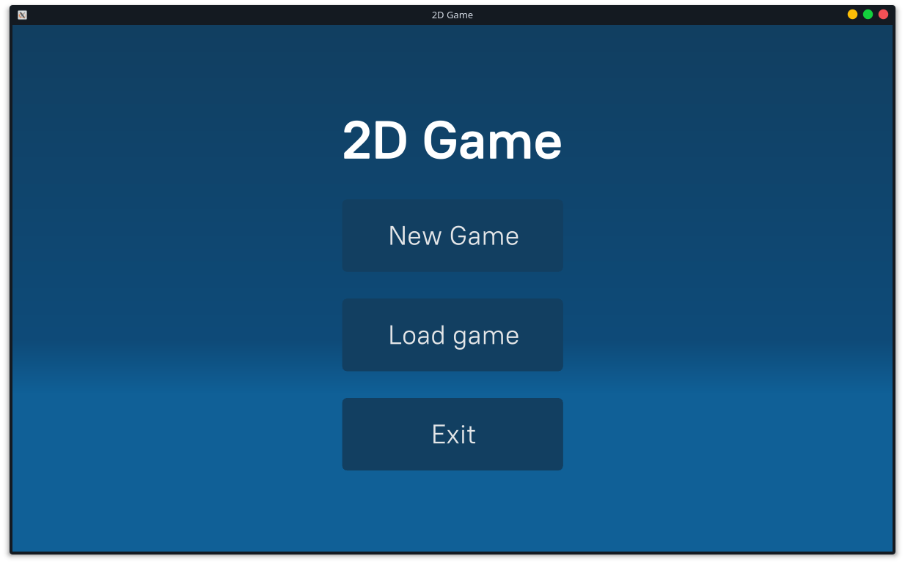
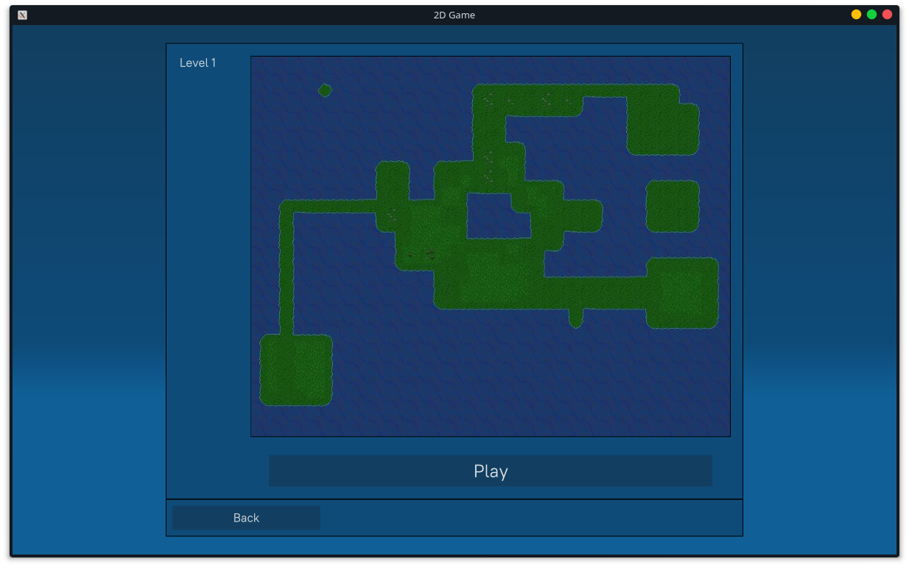
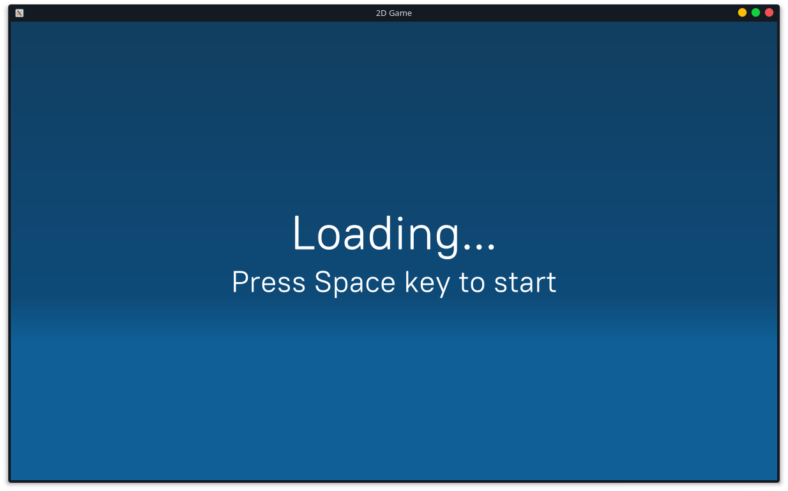
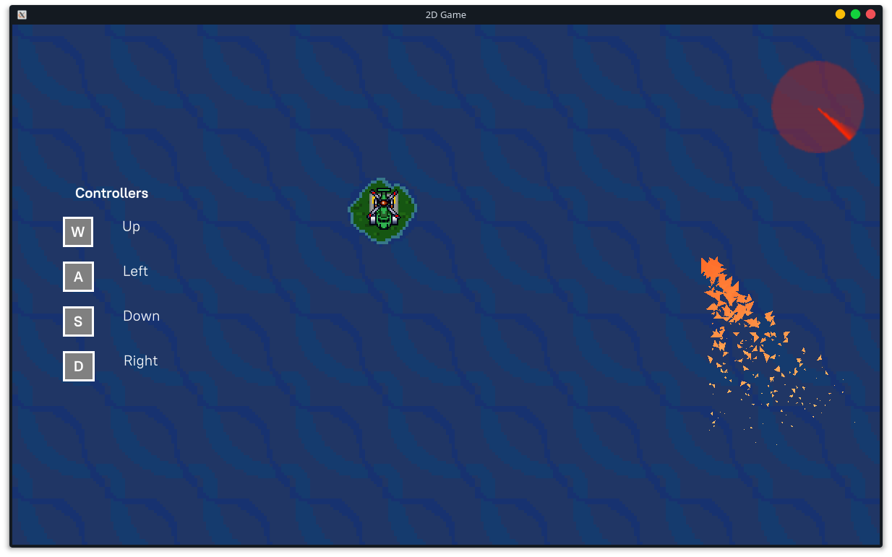
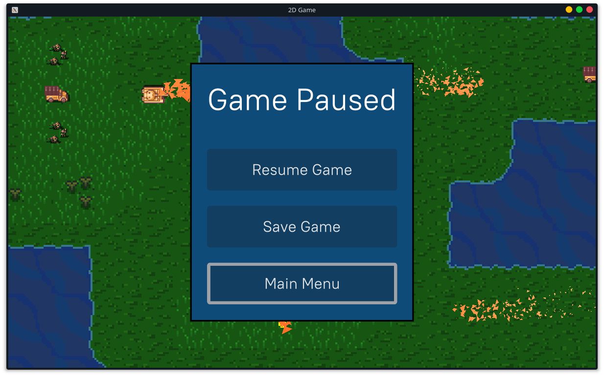
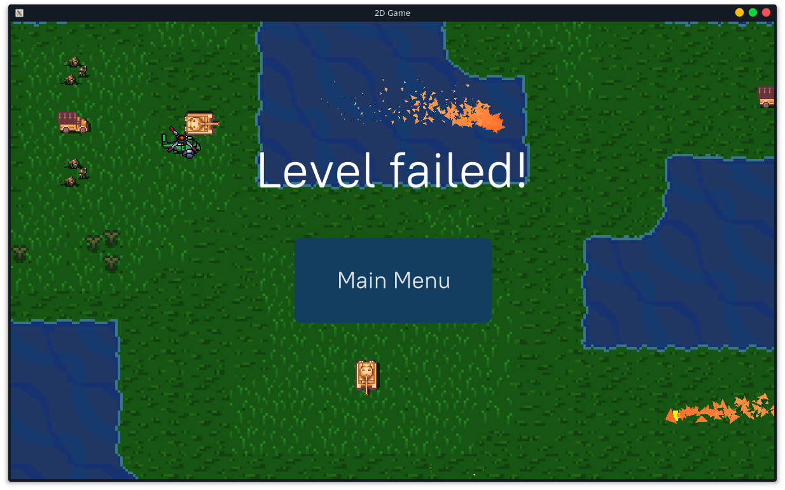

# Basic 2D Game
This is my first "serious" project, I decided to create it for a few reasons. Initially, it was to learn how to use some tools and create concepts like Contact system, GUI, Create and load save files and create a basic particle system. I am new in the world of game development; so this project has a lot of bugs and various elements don't work well, this is beacuse I just want to learn how to do that or get a simple idea of how to do it in the future.

## Third Party
* [glad Opengl Core 4.6](https://glad.dav1d.de)
* [GLFW 3.3.2](https://www.glfw.org)
* [GLM 0.9.9.7](https://glm.g-truc.net/0.9.9/index.html)
* [stb_image](https://github.com/nothings/stb)
* [EnTT 3.5.2](https://github.com/skypjack/entt)
* [Box2D 2.4.1](https://box2d.org)
* [TinyXML-2](https://github.com/leethomason/tinyxml2)
* [Sol2 3.2.1](https://github.com/ThePhD/sol2)
* [NoesisGUI 3.0.7](https://www.noesisengine.com)
* [irrKlang 1.6](https://www.ambiera.com/irrklang/)
* [Cereal 1.3.0](https://github.com/USCiLab/cereal)

## Assets
All the assets were obtained from this course [Fundamentals of 2D Game Engines with C++ SDL and Lua](https://www.udemy.com/course/cpp-2d-game-engine/)